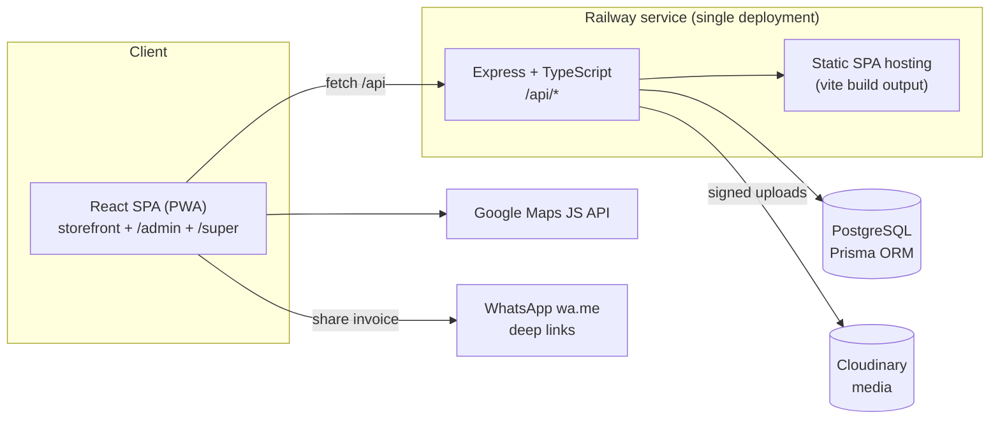

# Mat'ami Platform — System Architecture

## Topology



One Railway service runs Express which serves both the JSON API under `/api` and the
built SPA for every other route. Postgres is a Railway add-on; Cloudinary stores
images; Google Maps renders zone editors and address pickers in the browser.

## Repository layout

```
matami-platform/
  docs/                      PRD, DB design + ERD, architecture, wireframes
  server/                    Express + TS + Prisma
    prisma/schema.prisma
    src/
      env.ts                 validated env access (no hardcoded secrets)
      app.ts                 express app wiring (helmet-ish headers, rate limits)
      index.ts               bootstrap: migrate-safe start, super-admin seed, listen
      lib/                   jwt, passwords, rbac, geo, pricing, invoice, audit, http
      middleware/            auth (access token), tenant scope, error handler
      routes/
        auth.ts              login/refresh/logout (staff+admins), customer auth
        public.ts            storefront catalog, zone resolve, orders, tracking, reviews
        admin/               restaurant panel: orders, catalog, zones, marketing,
                             staff, customers, builder/theme, reports, uploads
        super.ts             super admin: restaurants, plans, subscriptions, users,
                             themes, platform settings, global analytics
    test/                    vitest unit tests (pricing, geo, coupons, rbac)
  web/                       React + Vite + Tailwind + PWA
    src/
      lib/                   api client, auth stores, i18n, theme engine, format
      components/            UI kit (Button, Input, Modal, Table, MapPicker...)
      pages/store/           customer website
      pages/admin/           restaurant admin panel
      pages/super/           super admin panel
  railway.json / nixpacks.toml
```

## Request lifecycle

1. **AuthN** — `POST /api/auth/login` → access JWT (15 min, `Authorization: Bearer`)
   + refresh token (30 d, httpOnly `SameSite=Lax` cookie, rotated on every refresh,
   SHA-256 hash stored). Customers use a parallel lightweight JWT (`aud=customer`).
2. **AuthZ (RBAC)** — `requireRole(...roles)` + `requirePermission(perm)`;
   permission matrix in `lib/rbac.ts`. STAFF permissions are stored per user.
3. **Tenant scope** — for restaurant-panel routes, `req.tenant.restaurantId` comes from
   the JWT; queries are scoped through `tenantWhere(req)` helpers. Super-admin routes
   take an explicit `restaurantId` param.
4. **Validation** — zod schemas per endpoint; structured 400s.
5. **Pricing** — `lib/pricing.ts` recomputes cart server-side (variants, addons,
   offers, coupon, zone fee, VAT) — clients never set prices.
6. **Audit + rate limits** — sensitive routes append audit logs; login & order
   creation are rate limited per IP.

## Theme engine

`Restaurant.theme` (published) and `themeDraft` (work in progress) are JSON documents:
colors, fonts, radii, header/footer config, banner URLs, section list for the
homepage builder. The SPA converts a theme document into CSS variables on a wrapper
element, so storefront, live preview, and template gallery all share one renderer.
`ThemeTemplate` rows hold the 8 shipped presets; "publish" copies `themeDraft → theme`.

## Subscriptions enforcement

`requireActiveSubscription` middleware guards the storefront ordering endpoints:
restaurant with `TRIAL`/`ACTIVE` subscription → orders allowed; otherwise storefront
returns `402 subscription_required` and the site renders a "temporarily unavailable"
page. Plan limits (branches/products/staff) are enforced on create endpoints.

## Notifications

`lib/notify.ts` defines a `Channel` interface (`whatsapp`, `sms`, `email`, `push`).
WhatsApp ships enabled using wa.me deep links (no external account needed); the other
channels are no-op providers ready to receive vendor credentials via env.
