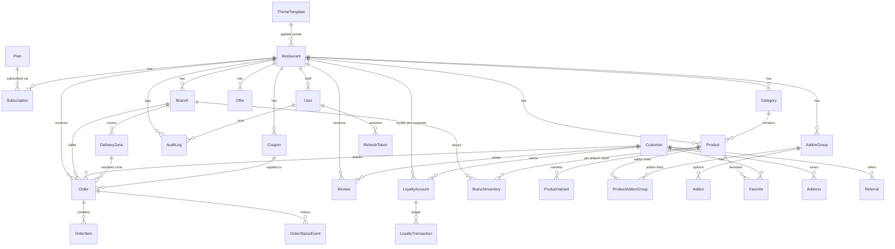

# Mat'ami Platform — Database Design

PostgreSQL via Prisma ORM. All money values are stored as `Decimal(10,2)`; all
user-facing text is bilingual (`*_en` / `*_ar`). Every tenant-owned row carries
`restaurantId` — the API layer always filters by it (tenant isolation).

## ERD

## Model groups

| Group | Models | Notes |
|---|---|---|
| Tenancy | `Restaurant`, `Branch` | `Restaurant.theme/themeDraft/homepage/settings/socials` are JSON documents powering the no-code builders |
| Access | `User`, `RefreshToken` | `User.role` ∈ SUPER_ADMIN / RESTAURANT_OWNER / BRANCH_MANAGER / STAFF; `User.permissions[]` refines STAFF |
| Billing | `Plan`, `Subscription` | limits + feature flags as JSON on plan |
| Catalog | `Category`, `Product`, `ProductVariant`, `AddonGroup`, `Addon`, `ProductAddonGroup`, `BranchInventory` | |
| Customers | `Customer`, `Address`, `Favorite`, `LoyaltyAccount`, `LoyaltyTransaction`, `Referral` | customers are platform-global; loyalty is per restaurant |
| Ordering | `Order`, `OrderItem`, `OrderStatusEvent` | item rows snapshot names/prices at purchase time |
| Marketing | `Coupon`, `Offer`, `Review` | review moderation via `status` |
| Delivery | `DeliveryZone` | `POLYGON` (GeoJSON-like ring) or `RADIUS` (center+km); fee, minOrder, freeOver, weekly schedule JSON |
| Theming | `ThemeTemplate` | global presets managed by super admin |
| Platform | `PlatformSetting`, `AuditLog` | singleton JSON settings; append-only audit trail |

## Key invariants

1. **Tenant isolation** — every query in the admin API derives `restaurantId` from the
   JWT, never from the request body.
2. **Price integrity** — `Order.subtotal/deliveryFee/discount/vatAmount/total` are
   computed server-side from DB prices at order time; order items snapshot
   bilingual names and unit prices.
3. **Refresh-token rotation** — `RefreshToken` rows store SHA-256 hashes only;
   reuse of a rotated token revokes the whole session family.
4. **Soft availability** — products/categories/branches/zones use `isActive` flags;
   nothing is hard-deleted by storefront actions.
5. **Audit** — mutating admin endpoints append `AuditLog(actor, action, entity, meta, ip)`.
